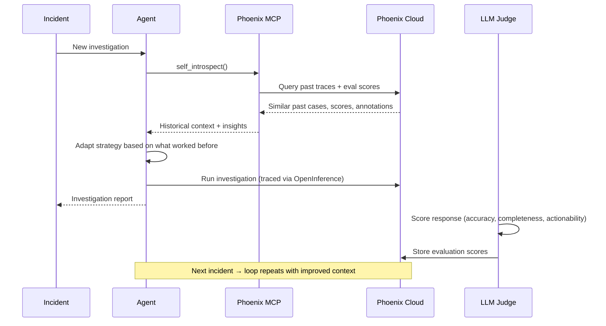
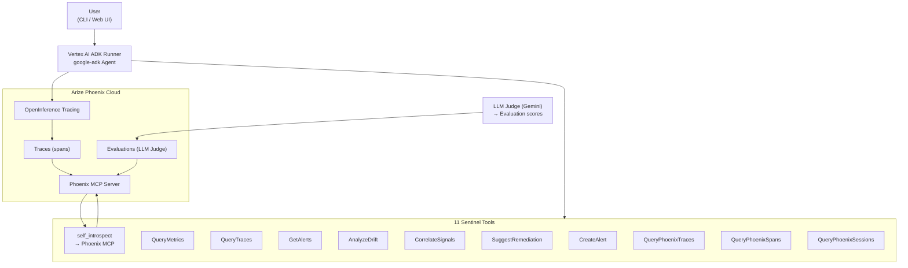

# Sentinel SRE Agent

[](LICENSE)
[](pyproject.toml)
[](https://sentinel-sre-agent-t4k2mrvyaq-uc.a.run.app)

**Self-improving SRE agent for ML model observability and incident response.**

Built for the [Google Cloud Rapid Agent Hackathon](https://rapid-agent.devpost.com/) — Arize Partner Track.

## What It Does

Sentinel is an AI agent that investigates ML production incidents by querying real-time metrics, traces, and drift signals — and gets smarter over time by querying its own past investigation traces via Arize Phoenix MCP, adapting its reasoning based on what worked before. Every investigation is traced to Phoenix Cloud, scored by an LLM judge, and the scores feed back into the agent's self-improvement loop for the next incident.

## Try It in 60 Seconds

```bash
curl -X POST https://sentinel-sre-agent-t4k2mrvyaq-uc.a.run.app/run \
  -H "Content-Type: application/json" \
  -d '{"mission": "URGENT: Error rate on fraud-detection-v1 just spiked to 15%. Investigate immediately and tell me what to do."}'
```

Expected output (truncated):
```json
{
  "content": "**Summary**\nFraud-detection-v1 is experiencing a critical error rate...\n\n**Evidence**\n...",
  "session_id": "...",
  "evaluation": {
    "overall_score": 4.5,
    "accuracy": 4.5,
    "completeness": 4.0,
    "actionability": 5.0,
    ...
  }
}
```

## How the Self-Improvement Loop Works



## Architecture



## Judging Criteria

| Criterion | What We Built | Where to See It |
|---|---|---|
| **Uses Google Cloud Agent Builder** | Vertex AI ADK (`google-adk` 2.x) `Agent` + `Runner` + `FunctionTool` wrapping all 11 tools | `src/sentinel/agent/adk_agent.py` |
| **Arize Phoenix Integration** | OpenInference traces every LLM call to Phoenix Cloud; agent queries Phoenix via MCP for self-improvement | `src/sentinel/tracing.py`, `src/sentinel/mcp/phoenix_client.py` |
| **Self-Improvement Loop** | `self_introspect` tool queries Phoenix MCP for similar past cases and eval scores; agent adapts reasoning from historical patterns | `src/sentinel/tools/self_introspect.py`, system prompt in `src/sentinel/agent/prompts.py` |
| **Multi-Tool Investigation** | 11 tools: metrics, traces, alerts, drift analysis, signal correlation, alert creation, remediation suggestions, Phoenix introspection | `src/sentinel/tools/` directory |
| **LLM-as-a-Judge Evaluation** | Gemini evaluates every response on accuracy, completeness, actionability (1-5 scale) | `src/sentinel/evaluation/llm_judge.py` |
| **Streaming Web UI** | Vanilla JS dashboard with SSE streaming, health badges, phoenix/data-source indicators | `src/sentinel/static/index.html`, `src/sentinel/server.py` |
| **Cloud Run Deployable** | Dockerfile with healthcheck, GitHub Actions CI → Artifact Registry → Cloud Run | `Dockerfile`, `.github/workflows/deploy.yml` |

## Tech Stack

| Component | Technology |
|---|---|
| Agent Framework | Vertex AI ADK (`google-adk` 2.x) |
| LLM | Gemini 2.5 Flash Lite |
| Observability | Arize Phoenix Cloud (traces, spans, evaluations) |
| MCP Integration | `@arizeai/phoenix-mcp` over stdio |
| Tracing | OpenInference + OpenTelemetry OTLP |
| Evaluation | Gemini LLM-as-a-Judge |
| Web UI | Vanilla JS, SSE (no build step) |
| API Server | FastAPI + Uvicorn |
| Deployment | Cloud Run + GitHub Actions |

## Project Structure

```
sentinel-sre-agent/
├── src/sentinel/
│   ├── agent/
│   │   ├── adk_agent.py      # Vertex AI ADK agent (primary)
│   │   ├── core.py           # Legacy google-genai agent (fallback)
│   │   └── prompts.py        # System prompt with self-improvement guidance
│   ├── mcp/
│   │   ├── phoenix_client.py # Phoenix MCP client (real MCP protocol)
│   │   └── arize_client.py   # High-level Arize data access layer
│   ├── tools/
│   │   ├── query.py          # query_metrics (with Phoenix fallback), query_traces, get_alerts
│   │   ├── analyze.py        # analyze_drift, correlate_signals
│   │   ├── actions.py        # create_alert, suggest_remediation
│   │   ├── self_introspect.py# Self-improvement loop (queries Phoenix MCP)
│   │   └── phoenix_tools.py  # Raw Phoenix trace/span/session queries
│   ├── evaluation/
│   │   └── llm_judge.py      # LLM-as-a-judge evaluation
│   ├── static/
│   │   └── index.html        # Streaming web UI
│   ├── server.py             # FastAPI server with SSE + health
│   ├── tracing.py            # OpenInference → Phoenix tracing
│   ├── scenarios.py          # Demo scenarios
│   └── cli.py                # CLI entry point
├── Dockerfile
├── pyproject.toml
└── README.md
```

## Running Locally

**1. Clone and install:**
```bash
git clone https://github.com/dumbL4d/sentinel-sre-agent.git
cd sentinel-sre-agent
python -m venv .venv && source .venv/bin/activate
pip install -e ".[dev]"
```

**2. Set environment variables (all required):**
```bash
export GEMINI_API_KEY="your-key-from-aistudio.google.com"
export PHOENIX_API_KEY="your-key-from-app.phoenix.arize.com"
export PHOENIX_COLLECTOR_ENDPOINT="https://app.phoenix.arize.com"
```

**3. Run the server:**
```bash
sentinel-serve
```

**4. Open the web UI:**
```
http://localhost:8000/ui/
```

**5. Or use the CLI:**
```bash
sentinel interactive --demo
```

## Known Limitations

- **QueryMetrics synthetic fallback**: When a Phoenix project has no matching model spans (or returns < 5 spans), `QueryMetrics` silently falls back to seeded synthetic data. The `data_source` field in the response indicates whether data came from Phoenix or the synthetic generator.
- **Text-based similarity for self-improvement**: The self-improvement loop finds past cases using token overlap (bag-of-words), not semantic embeddings. A future upgrade would use Phoenix's native embedding search for more relevant historical context retrieval.
- **No human-in-the-loop for remediation**: `create_alert` and `suggest_remediation` execute immediately without requiring manual approval. A production deployment should gate remediation actions behind a human review step.

## License

MIT
