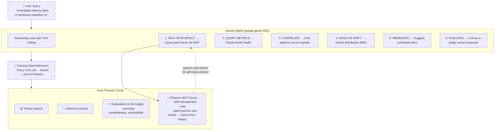

# Sentinel SRE Agent

**Self-improving SRE agent for ML model observability and incident response.**

Built for the [Google Cloud Rapid Agent Hackathon](https://rapid-agent.devpost.com/) — Arize Partner Track.

> AI that doesn't just provide answers — it investigates incidents, learns from past performance, and gets better over time.

## Why This Matters

When ML models degrade in production, engineers need more than alerts — they need an agent that can:
- **Investigate** incidents across metrics, traces, and drift signals
- **Correlate** signals to find root causes (not just symptoms)
- **Self-reflect** by querying its own past performance via Phoenix MCP
- **Recommend** specific, prioritized remediation actions
- **Learn** from evaluations to improve future investigations

## Architecture



## Quick Start

### 1. Set up API keys

```bash
cp .env.example .env
# Edit .env with your keys:
# GEMINI_API_KEY=your-key-from-aistudio.google.com
# PHOENIX_API_KEY=your-key-from-app.phoenix.arize.com
```

Get your keys:
- **Gemini**: [aistudio.google.com/app/apikey](https://aistudio.google.com/app/apikey)
- **Phoenix Cloud**: [app.phoenix.arize.com](https://app.phoenix.arize.com) (free tier)

### 2. Install

```bash
python -m venv .venv && source .venv/bin/activate
pip install -e ".[dev]"
```

### 3. Run

**Interactive mode:**
```bash
sentinel interactive --demo          # Demo mode with seeded data
sentinel interactive                  # Live mode (requires API keys)
```

**Run all demo scenarios with evaluation:**
```bash
sentinel demo-scenarios --demo --evaluate
```

**List scenarios:**
```bash
sentinel scenarios
```

## Hackathon Requirements Checklist

- [x] **Code-owned agent runtime** — Uses `google-genai` SDK with tool calling
- [x] **OpenInference tracing** — All LLM calls instrumented via `openinference-instrumentation-google-genai`
- [x] **Traces to Phoenix** — Sent to Phoenix Cloud (or local Phoenix server)
- [x] **Phoenix MCP integration** — Agent self-introspects on its own traces at runtime
- [x] **LLM-as-a-judge evaluations** — Evaluates responses on accuracy, completeness, actionability
- [x] **Self-improvement loop** — Agent reviews past traces and evaluations to adapt reasoning

## Demo Scenarios

| ID | Scenario | Complexity | What It Shows |
|----|----------|------------|---------------|
| `scenario-001` | Latency Spike Investigation | Medium | Multi-step investigation, correlation, remediation |
| `scenario-002` | Model Drift Analysis | Medium | Drift detection, feature analysis, retraining recommendation |
| `scenario-003` | Critical Incident Response | High | End-to-end incident response with all tools |
| `scenario-004` | Performance Health Check | Low | Comprehensive health assessment across models |

## Project Structure

```
sentinel-sre-agent/
├── src/sentinel/
│   ├── __init__.py
│   ├── agent/
│   │   ├── core.py           # Gemini agent with tool calling loop
│   │   └── prompts.py        # System prompt with self-improvement guidance
│   ├── mcp/
│   │   └── phoenix_client.py # Phoenix MCP client for self-introspection
│   ├── tools/
│   │   ├── base.py           # Base tool class
│   │   ├── query.py          # query_metrics, query_traces, get_alerts
│   │   ├── analyze.py        # analyze_drift, correlate_signals
│   │   ├── actions.py        # create_alert, suggest_remediation
│   │   └── self_introspect.py# Agent queries own Phoenix traces
│   ├── evaluation/
│   │   └── llm_judge.py      # LLM-as-a-judge evaluation pipeline
│   ├── tracing.py            # OpenInference → Phoenix tracing setup
│   ├── scenarios.py          # Demo scenarios for hackathon presentation
│   └── cli.py                # CLI with interactive, demo, and evaluate modes
├── tests/
├── pyproject.toml
├── .env
└── README.md
```

## Self-Improvement Loop

The agent gets better over time through this cycle:

1. **Investigate** — Agent handles an incident using tools
2. **Trace** — Every call is traced to Phoenix via OpenInference
3. **Evaluate** — LLM-as-a-judge scores the response (1-5 on accuracy, completeness, actionability)
4. **Learn** — On future incidents, the agent queries Phoenix MCP for similar past cases
5. **Adapt** — Agent reviews what worked and what didn't, adjusting its approach

## License

MIT
